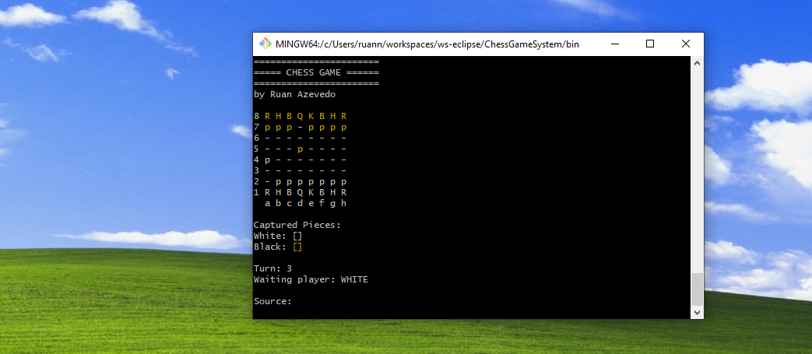

# ChessGameSystem

---

# Sobre

Este é um projeto para aprendizagem em programação **orientada a objetos** com a linguagem **Java**. Projeto organizado pelo professor Nélio Alves no seu curso de Java na plataforma Udemy.

Este projeto é um simples jogo de xadrez multiplayer local exibido no console, na qual um jogador joga por vez.

O objetivo desse projeto é fixar os conhecimentos em programação orientada a objetos bem como a linguagem Java.

# Como executar o projeto

Pré-requisitos: Java 17.